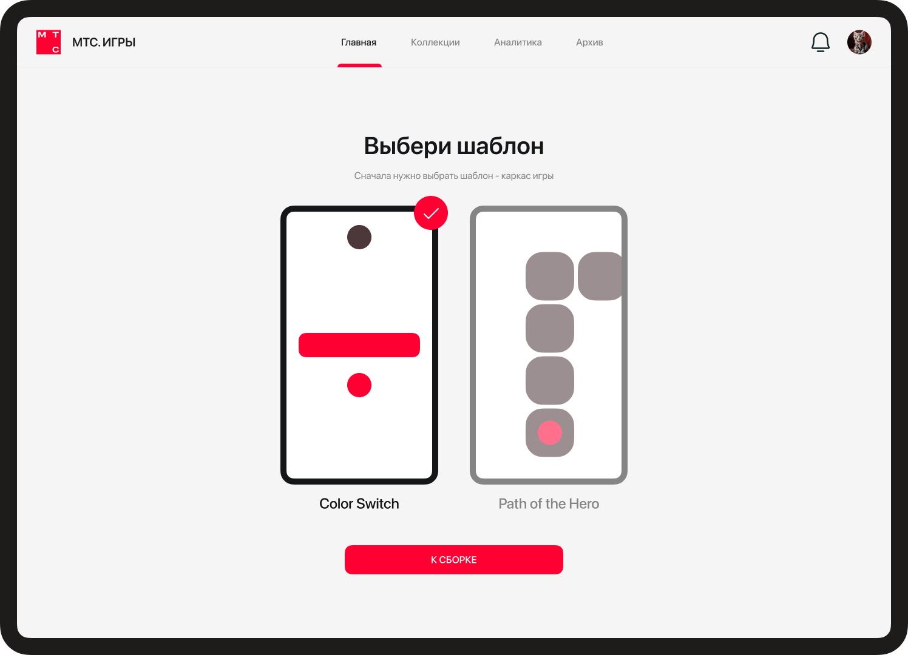
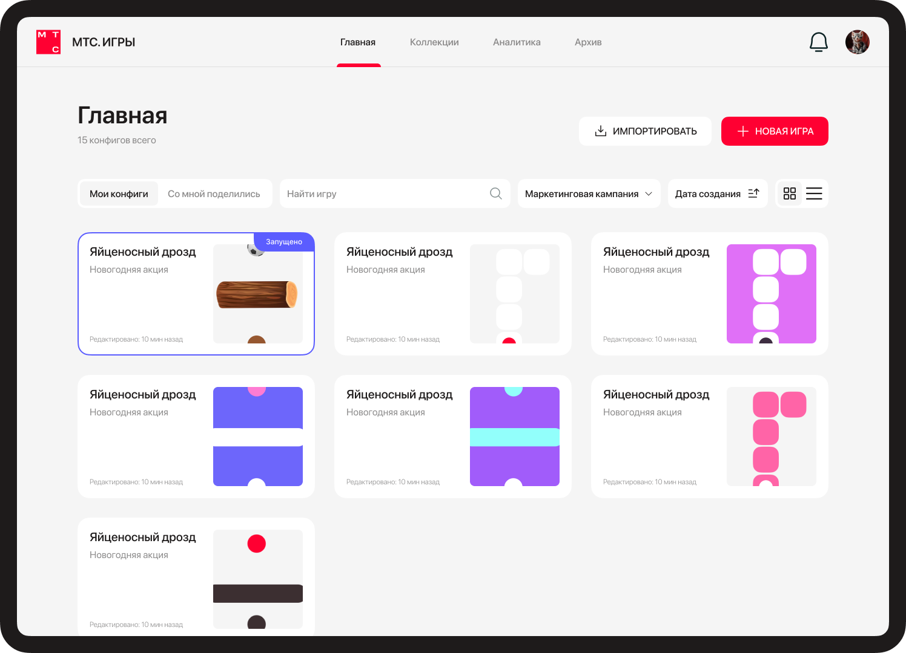
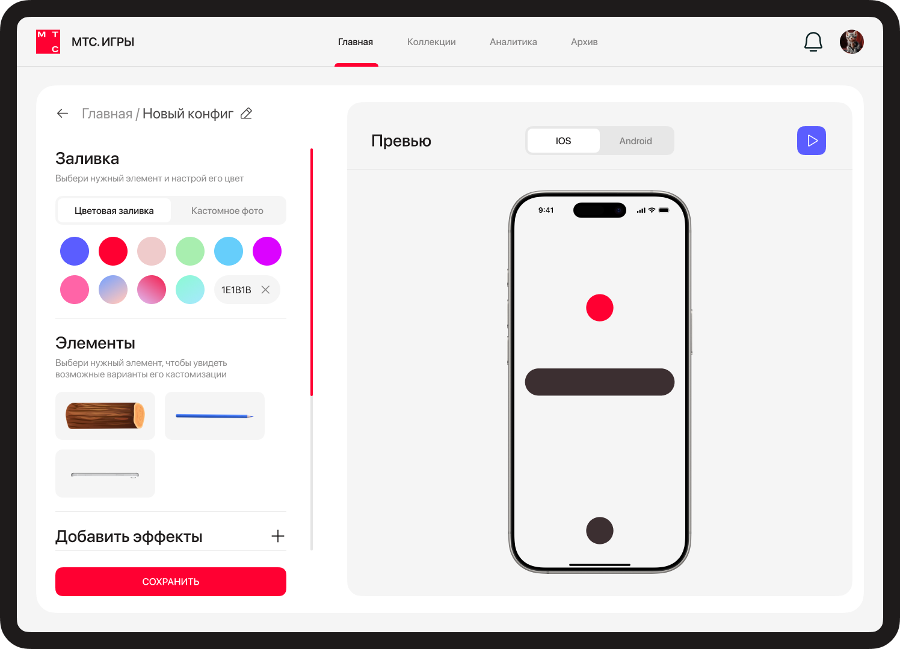
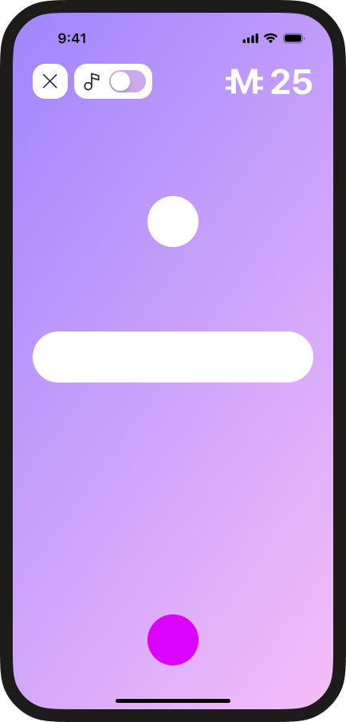
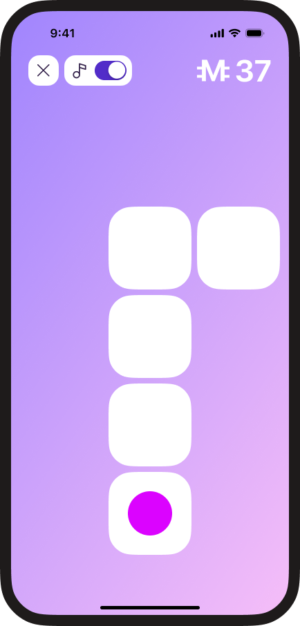
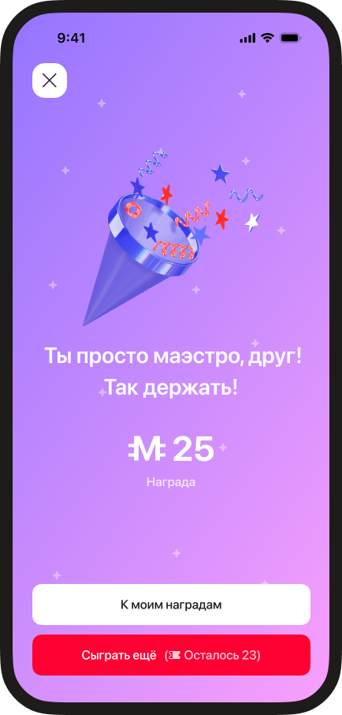
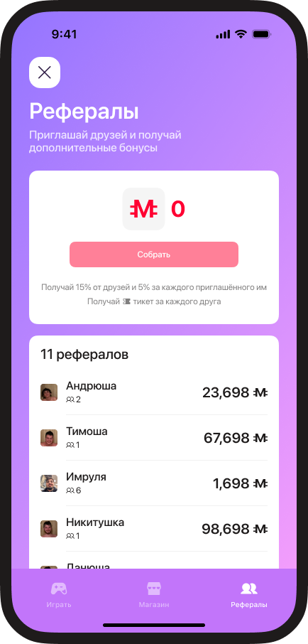
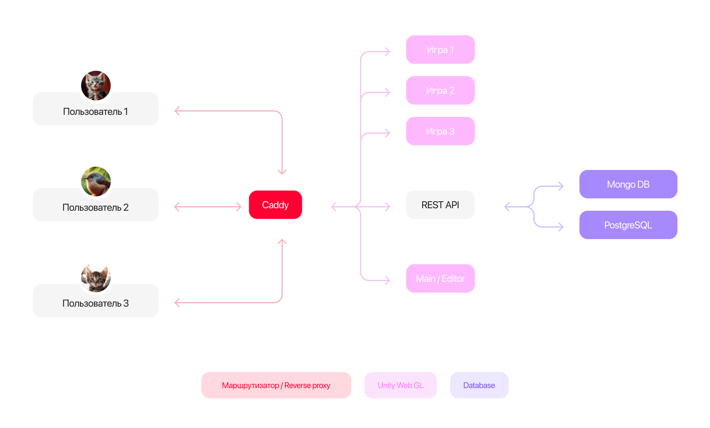

<br />
<div align="center">
    
  <h2 align="center">MTC.ИГРЫ</h2>
  <h3 align="center">MISIS venum</h3>
</div>

<div align="center">


</div>

# 🚀  О Проекте
Наш сервис представляет собой конструктор тайм-киллер игр, который будет внедрён в корпоративную систему 
банка для создания игровых механик, направленных на вовлечение пользователей и повышение их лояльности. Этот инструмент позволяет сотрудникам, 
даже не имеющим технической подготовки, быстро и легко разрабатывать игры, 
которые впоследствии будут интегрированы в приложение банка.

## 🖼️ Превью

### Экраны Web приложения
<div style="display: grid; grid-template-columns: repeat(2, auto)">




</div>

| Экраны Web приложения  |  |
| ------------- | ------------- |
|   |   |
|   |   |

### Экраны игр
<div style="display: grid; grid-template-columns: repeat(5, auto)">





</div>


## 📚 Установка 

### Требования 
На вашей машине должне быть установлен **docker compose**.

### Инструкция по установке и запуску 

Скачайте и перейдите в директорию проекта.
```zsh
git clone git@github.com:Klopi746/MTS_Hack20.git # клонирование репозитория
cd MTS_Hack20 # переход в рабочую директорию

```
Далее нужно создать и заполнить .env по аналогии с .env.example:
```zsh
# General
DOMAIN=<ХОСТ СЕРВИСА>

# Backend Config
BACKEND_APPLICATION=<НАЗВАНИЕ REST ПРИЛОЖЕНИЯ>
BACKEND_MODE=<DEV, PROD>


# Postgres
POSTGRES_USER=<ПОЛЬЗОВАТЕЛЬ БД>
POSTGRES_PASSWORD=<ПАРОЛЬ ОТ БД>
POSTGRES_HOST=<ХОСТ БД>
POSTGRES_DB=<НАЗВАНИЕ БД>
POSTGRES_PORT=<ПОРТ БД>


# Mongo
MONGO_DRIVER=<ДРАЙВЕР МОНГИ>
MONGO_HOST=<ХОСТ МОНГИ>
MONGO_DB_NAME=<НАЗВАНИЕ БАЗЫ ДАННЫХ>
MONGO_PORT=<ПОРТ МОНГИ>
```

После чего можно запустить проект
```zsh
docker compose up --build -d
```

**!Адресс запросов к REST API фиксированный для билда игры. Его нужно менять внутри игры, а затем сделать и загрузить новый билд**

### Настройка CI / CD
Для работы автодеплоя в настройках репозитория на Github нужно настроить следующие параметры:
```shell
HOST=<Адрес сервера, на котором расположен проект>
PROJECT_DIR=<Рабочая директория проекта>
USERNAME=<Пользователь сервера(Linux)>
PASSWORD=<Пароль пользователя>
```

## ⚙️ Архитектруа 


## 📋 Основной функционал 
- [x] Web приложение
  - [x] Просмотр готовых конфигураций для игр
  - [x] Установка текущей конфигурации для конкретной игры 
  - [x] Редактор игр
  - [x] Возможность добавлять / удалять / редактировать конфигурации игр
  - [ ] Возможность добавлять новые игры
- [x] Игры 
  - [x] Игры Color Switch
  - [x] Игра Path of Hero
- [ ] Система накопления и траты очков
- [ ] Реферальная система 
- [ ] Внутриигровой / МТС магазин


## 🗨️ Состав команды 
[Крылов Никита](https://github.com/NikitaKrylov) - **Backend / DevOps / Lead**

[Имран Шокуев](https://github.com/imka07) - **Unity Dev**

[Данила Бочаров](https://github.com/Klopi746) - **Unity Dev**

[Тимофей Костров](https://t.me/timkoskos) - **UI / UX / Frontend**

[Андрей Тычинин](https://t.me/timkoskos) - **UI / UX / Frontend**


